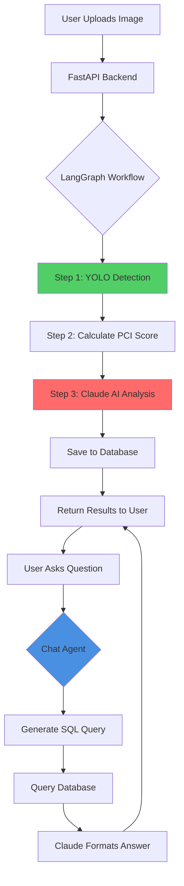

# 🛣️ Pavement Assessment AI Agent

AI-powered pavement condition assessment using YOLO, LangGraph, and AWS Bedrock.

[](https://www.python.org/)
[](https://fastapi.tiangolo.com/)
[](https://langchain.com/)
[](https://langchain-ai.github.io/langgraph/)
[](https://aws.amazon.com/bedrock/)
---

## 🎯 Overview

This project demonstrates a production-grade agentic AI system that:
- Analyzes pavement images using custom YOLO object detection
- Calculates PCI (Pavement Condition Index) scores following ASTM D6433 standards
- Generates AI-powered recommendations using AWS Bedrock (Claude 3.5 Sonnet)
- Provides natural language chat interface with Text-to-SQL capabilities

**Note:** This is a portfolio/learning project demonstrating agentic AI architecture.

---

## 🏗️ System Flow


---

## 🚀 Features

- ✅ **Multi-step Agent Workflows** - LangGraph orchestration with observable reasoning
- ✅ **Computer Vision** - Custom YOLOv8 model trained on pavement defects
- ✅ **AI Analysis** - AWS Bedrock (Claude 3.5) for intelligent recommendations
- ✅ **Text-to-SQL** - Natural language database queries
- ✅ **RESTful API** - FastAPI with automatic documentation
- ✅ **Interactive UI** - Gradio interface for easy testing
- ✅ **Production-Ready** - Error handling, logging, environment configs

---

## 🛠️ Technology Stack

- **LangChain & LangGraph** - Agent orchestration
- **AWS Bedrock** - Claude 3.5 Sonnet LLM
- **YOLOv8** - Custom object detection model
- **FastAPI** - Backend API framework
- **SQLite** - Database (PostgreSQL-ready)
- **Gradio** - Frontend interface
- **Python 3.13**

---

## 📦 Installation

### Prerequisites:
- Python 3.10+
- AWS Account with Bedrock access
- 8GB RAM minimum

### Setup:
```bash
# Clone repository
git clone https://github.com/ibragimoveldor/pavement-assessment-agent.git
cd pavement-assessment-agent

# Create virtual environment
python -m venv venv
source venv/bin/activate  # Windows: venv\Scripts\activate

# Install dependencies
pip install -r requirements.txt

# Configure environment
cp .env.example .env
# Edit .env with your AWS credentials
```

---

## ⚙️ Configuration

Create `.env` file:
```bash
# AWS Configuration
AWS_REGION=us-east-1
AWS_ACCESS_KEY_ID=your_access_key
AWS_SECRET_ACCESS_KEY=your_secret_key

# Database
DATABASE_URL=sqlite:///./pavement_assessment.db

# Application
UPLOAD_DIR=uploads
MAX_FILE_SIZE=10485760

# YOLO Model
YOLO_MODEL_PATH=yolov8n.pt
```

---

## 🏃 Running the Application

### Start Backend:
```bash
uvicorn app.main:app --reload --host 0.0.0.0 --port 8000
```

### Start Frontend (separate terminal):
```bash
python frontend/gradio_app.py
```

### Access:
- **Gradio UI:** http://localhost:7860
- **API Docs:** http://localhost:8000/docs
- **Health Check:** http://localhost:8000/health

---

## 📖 Usage

### Via UI:
1. Open http://localhost:7860
2. Upload pavement image
3. Click "Analyze Pavement"
4. View PCI score, defects, and AI recommendations
5. Ask questions in chat: "What's the repair cost?"

### Via API:
```bash
# Analyze image
curl -X POST "http://localhost:8000/api/v1/analyze" \
  -F "file=@pavement.jpg"

# Chat
curl -X POST "http://localhost:8000/api/v1/chat" \
  -H "Content-Type: application/json" \
  -d '{"assessment_id": "abc-123", "question": "What repairs are needed?"}'
```

---

## 📊 Custom YOLO Model

**Detects 4 defect types:**
- `apothole` - Surface cavities
- `spalling` - Surface deterioration
- `patching` - Repair areas
- `rm` - Road markings

**To use your own model:**
1. Place `.pt` file in project directory
2. Update `YOLO_MODEL_PATH` in `.env`
3. Update class mappings in `app/models/yolo_detector.py`

---

## 🧪 Testing
```bash
# Test AWS connection
python test_aws_complete.py

# Test YOLO model
python test_yolo.py

# Test database
python test_db.py
```

---

## 📁 Project Structure
```
pavement-assessment-agent/
├── app/
│   ├── main.py              # FastAPI application
│   ├── config.py            # Settings
│   ├── agents/
│   │   ├── graph.py         # LangGraph workflows
│   │   └── tools.py         # Agent tools
│   ├── models/
│   │   ├── yolo_detector.py # YOLO wrapper
│   │   └── pci_calculator.py# PCI scoring
│   ├── api/routes/
│   │   ├── analyze.py       # Analysis endpoints
│   │   └── chat.py          # Chat endpoints
│   └── database/
│       ├── models.py        # SQLAlchemy models
│       └── crud.py          # Database operations
├── frontend/
│   └── gradio_app.py        # Gradio UI
├── requirements.txt
├── .env.example
└── README.md
```

---

<!-- ## 🎯 Key Design Decisions

**LangGraph over Simple Chains:**
- Multi-step reasoning with observable workflows
- Error recovery at each stage
- Conditional routing based on intermediate results

**AWS Bedrock vs Direct API:**
- Enterprise cloud integration
- Better for production deployment
- AWS ecosystem compatibility

**Custom YOLO Model:**
- Domain-specific defect detection
- Shows ML engineering capabilities
- Better accuracy than generic models

**API-First Architecture:**
- Frontend-agnostic design
- Easy to add web/mobile clients
- Testable business logic

---

## 💰 Cost Estimate

**Development/Demo:**
- AWS Bedrock: $3-5 per demo
- Other services: Free (local)

**Production (1000 req/day):**
- AWS Bedrock: ~$300/month
- Compute: ~$50/month
- Database: ~$30/month
- **Total: ~$380/month** -->

---

## 🔒 Security

- ✅ Environment-based configuration
- ✅ Read-only SQL queries (safety)
- ✅ Input validation with Pydantic
- ✅ File type verification
- ✅ AWS IAM for access control

**Never commit:**
- `.env` files
- AWS credentials
- API keys

<!-- ---

<!-- ## 🚀 Production Deployment

**For production use:**
1. Migrate to PostgreSQL
2. Deploy FastAPI to AWS ECS/Lambda
3. Use S3 for image storage
4. Add CloudWatch monitoring
5. Set up CI/CD pipeline
6. Enable auto-scaling --> -->

---

## 📚 Documentation

- [Architecture Details](ARCHITECTURE.md) - System design and diagrams
- [API Documentation](http://localhost:8000/docs) - Interactive API docs
- [LangGraph Guide](https://langchain-ai.github.io/langgraph/)
- [AWS Bedrock Docs](https://docs.aws.amazon.com/bedrock/)

---

## 🤝 Contributing

This is a portfolio/learning project. For suggestions:
1. Open an issue
2. Describe the improvement
3. Submit a pull request

---

## 📄 License

This project is for educational/portfolio purposes.

---

## 👤 Author

**Eldor Ibragimov**
- GitHub: [@ibragimoveldor](https://github.com/ibragimoveldor)
- Portfolio: [eldoribragimov.cv]

---

## 🙏 Acknowledgments

- ASTM D6433 for PCI calculation methodology
- Anthropic for Claude AI
- Ultralytics for YOLOv8
- LangChain team for agent frameworks

---

**Built to demonstrate agentic AI architecture for infrastructure monitoring** 🚀